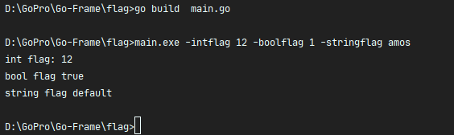
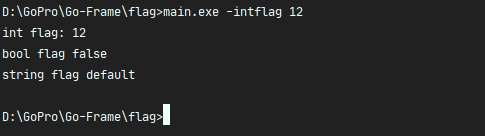
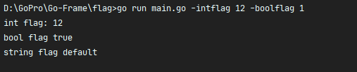

## Go中的标准库

### 简介

`flag`包实现了命令行标志解析。 。有过类 Unix 系统使用经验的童鞋对命令行选项应该不陌生。例如命令`ls -al`列出当前目录下所有文件和目录的详细信息，其中`-al`就是命令行选项。

指定配置文件的路径，如redis-server ./redis.conf以当前目录下的配置文件redis.conf启动 Redis 服务器；

自定义某些参数，如python -m SimpleHTTPServer 8080启动一个 HTTP 服务器，监听 8080 端口。如果不指定，则默认监听 8000 端口。

### 编译执行
```shell script
go build  main.go
main.exe -intflag 12 -boolflag 1 -stringflag amos
```


`如果不设置某个选项，相应变量会取默认值`



也可以直接使用`go run`，这个命令会先编译程序生成可执行文件，然后执行该文件，将命令行中的其它选项传给这个程序
```shell script
go run main.go -intflag 12 -boolflag 1
```



