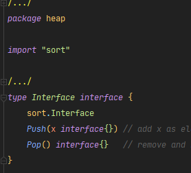
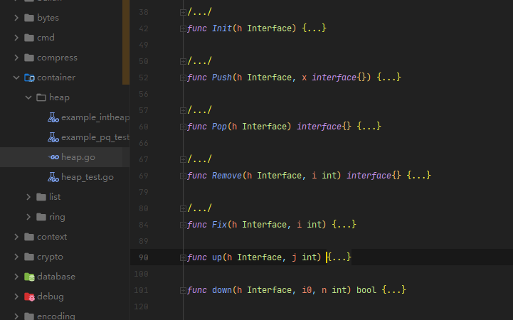

## heap

heap所处在包的位置`container/heap`

### 概述

标准库中的堆定义好了类型接口,在此基础上可以对堆进行增强实现
- 堆是一个`完全二叉树`
- 堆中每一个节点的值都必须大于等于（或小于等于）其子树中每个节点的值。

- 首先在源码中heap import `sort`包


```go
// heap.Interface
type Interface interface {
        sort.Interface
        Push(x interface{})       // 在Len()位置插入一个元素
        Pop() interface{}         // 删除并返回Len()-1位置的元素
}

// sort.Interface
type Interface interface {
        Len()                     // 获取当前对象的长度
        Swap(i, j interface{})    // 交换i,j位置两个元素的位置
        Less(i, j interface{})    // 比较i位置元素的值是否小于j位置元素
}
```
可以看出，实现了这些接口后,就可以使用heap包提供的函数了

heap内部有这些函数


- init 用于堆的初始化
```go
func Init(h Interface) {
	// heapify
	n := h.Len() //堆的len
	for i := n/2 - 1; i >= 0; i-- {
		down(h, i, n)
	}
}
```

- push和pop,这是堆的两个基本操作，push向堆内添加一个元素，pop弹出并返回堆顶元素
往堆中插入元素（从下往上）
```go
func Push(h Interface, x interface{}) {
	h.Push(x)
	up(h, h.Len()-1)
}
```

pop里的`down`函数

删除比较特殊,由于堆的特性,所有堆顶元素不是最大值就是最小值.删除堆顶元素后,我们还是需要堆化,为了避免出现 "数组空洞问题"

堆排序不是稳定的排序算法.
看源码可知在排序的过程，存在将堆的最后一个节点跟堆顶节点互换的操作，所以就有可能改变值相同数据的原始相对顺序。

```go
func Pop(h Interface) interface{} {
	n := h.Len() - 1
	h.Swap(0, n)
	down(h, 0, n)
	return h.Pop()
}
```

- remove   用于删除堆上特定位置的元素

```go
func Remove(h Interface, i int) interface{} {
	n := h.Len() - 1
	if n != i {
		h.Swap(i, n)
		if !down(h, i, n) {
			up(h, i)
		}
	}
	return h.Pop()
}
```
### 堆化 

堆化操作，就是顺着节点所在的路径，向上或者向下，对比，然后交换。

- down函数

down函数就是不断找当前节点的子节点（递归思想）,然后跟子节点比较大小,如果比子节点小就交换位置，否则就break
也就是说每个父节点都比叶子节点小，那么这么操作下去，根节点一定是最小的

```go
func down(h Interface, i0, n int) bool {
	i := i0
	for {
		j1 := 2*i + 1
		if j1 >= n || j1 < 0 { // j1 < 0 after int overflow
			break
		}
		j := j1 // left child
		if j2 := j1 + 1; j2 < n && h.Less(j2, j1) {
			j = j2 // = 2*i + 2  // right child
		}
		if !h.Less(j, i) {
			break
		}
		h.Swap(i, j)
		i = j
	}
	return i > i0
}
```

- up函数
up 函数和 down 函数操作刚好相反，down 是将一个元素不断得与自己子节点对比，从而实现父节点肯定比子节点小.
而 up 函数则反过来，不断将子节点与父节点对比，保证子节点比父节点大
```go

func up(h Interface, j int) {
	for {
		i := (j - 1) / 2 // parent
		if i == j || !h.Less(j, i) {
			break
		}
		h.Swap(i, j)
		j = i
	}
}

```
- fix函数
从i位置数据发生改变后，对堆进行再平衡
每次在堆上插入一个元素后，堆结构会被破坏，需要通过Fix函数将这个元素交换到合适的位置，以保证堆的特性

```go
func Fix(h Interface, i int) {
	if !down(h, i, h.Len()) {
		up(h, i)
	}
}
```


