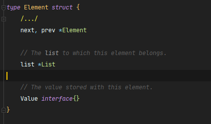

## list

heap所处在包的位置`container/list`

### 概述

container/list包实现了基本的双向链表功能，包括元素的插入、删除、移动功能


在源码包中，每个链表中元素的结构如下
- 通过Value属性来获取元素的值(注意是interface类型)



- 前后指针操作,Element还有两个方法Next和Prev分别获取当前元素的前一个元素和后一个元素


### 初始化

- init()
```go
func (l *List) Init() *List {
	l.root.next = &l.root
	l.root.prev = &l.root
	l.len = 0
	return l
}
```

- new() new函数也是调用了init方法

```go
// New returns an initialized list.
func New() *List { return new(List).Init() }
```

- 懒初始化
```go
func (l *List) lazyInit() {
	if l.root.next == nil {
		l.Init()
	}
}
```

### 遍历
链表常用操作

- 获取链表的头
```go
func (l *List) Front() *Element {
	if l.len == 0 {
		return nil
	}
	return l.root.next
}
```

- 获取链表尾
```go
// Back returns the last element of list l or nil if the list is empty.
func (l *List) Back() *Element {
	if l.len == 0 {
		return nil
	}
	return l.root.prev
}
```

获取到头或尾部元素后，使用该元素的Prev或Next方法即可向前或向后遍历，知道当前值等于先前期望的值

### 插入操作

```go
    func (l *List) InsertAfter(v interface{}, mark *Element) *Element // 在某个元素前插入
    func (l *List) InsertBefore(v interface{}, mark *Element) *Element  // 在某个元素后插入
```


调用的方法

- insertValue()
```go
// insertValue is a convenience wrapper for insert(&Element{Value: v}, at).
func (l *List) insertValue(v interface{}, at *Element) *Element {
	return l.insert(&Element{Value: v}, at)
}
```

- insert()
```go
func (l *List) insert(e, at *Element) *Element {
	e.prev = at //要插入的节点e的prev指向at节点
	e.next = at.next // 要插入节点的next指向at的next
	e.prev.next = e
	e.next.prev = e
	e.list = l
	l.len++
	return e
}
```


### 添加

- `PushBack`和`PushFront`用于在一个链表的头和尾添加元素


调用lazyinit和insertValue方法
```go
// PushFront inserts a new element e with value v at the front of list l and returns e.
func (l *List) PushFront(v interface{}) *Element {
	l.lazyInit()
	return l.insertValue(v, &l.root)
}

// PushBack inserts a new element e with value v at the back of list l and returns e.
func (l *List) PushBack(v interface{}) *Element {
	l.lazyInit()
	return l.insertValue(v, l.root.prev)
}
```


- 一次性添加一个list的`PushBackList`和`PushFrontList(即链表拼接)

- PushFront将链表插到原来的链表前面

- PushBack将新链表插到旧链表之后

```go
// PushBackList inserts a copy of another list at the back of list l.
// The lists l and other may be the same. They must not be nil.
func (l *List) PushBackList(other *List) {
	l.lazyInit()
	for i, e := other.Len(), other.Front(); i > 0; i, e = i-1, e.Next() {//正序遍历新链表一个个元素插入到旧链表的后面
		l.insertValue(e.Value, l.root.prev)
	}
}

// PushFrontList inserts a copy of another list at the front of list l.
 The lists l and other may be `the same`. They must `not be nil`.
func (l *List) PushFrontList(other *List) {
	l.lazyInit()
	for i, e := other.Len(), other.Back(); i > 0; i, e = i-1, e.Prev() {//倒序遍历新链表一个个元素插入到旧链表的前面
		l.insertValue(e.Value, &l.root)
	}
}
```


### 删除

链表删除操作，及时给nil，避免内存泄漏
```go
// remove removes e from its list, decrements l.len, and returns e.
func (l *List) remove(e *Element) *Element {
	e.prev.next = e.next
	e.next.prev = e.prev
	e.next = nil // avoid memory leaks
	e.prev = nil // avoid memory leaks
	e.list = nil
	l.len--
	return e
}
```

### 移动元素 

- MoveToFront 移动元素到表头
- MoveToBack 移动元素到表尾
- MoveBefore 移动到某个元素之前
- MoveAfter 移动到某个元素之后
```go
// MoveToFront moves element e to the front of list l.
// If e is not an element of l, the list is not modified.
// The element must not be nil.
func (l *List) MoveToFront(e *Element) {
	if e.list != l || l.root.next == e {
		return
	}
	// see comment in List.Remove about initialization of l
	l.move(e, &l.root)
}

// MoveToBack moves element e to the back of list l.
// If e is not an element of l, the list is not modified.
// The element must not be nil.
func (l *List) MoveToBack(e *Element) {
	if e.list != l || l.root.prev == e {
		return
	}
	// see comment in List.Remove about initialization of l
	l.move(e, l.root.prev)
}

// MoveBefore moves element e to its new position before mark.
// If e or mark is not an element of l, or e == mark, the list is not modified.
// The element and mark must not be nil.
func (l *List) MoveBefore(e, mark *Element) {
	if e.list != l || e == mark || mark.list != l {
		return
	}
	l.move(e, mark.prev)
}

// MoveAfter moves element e to its new position after mark.
// If e or mark is not an element of l, or e == mark, the list is not modified.
// The element and mark must not be nil.
func (l *List) MoveAfter(e, mark *Element) {
	if e.list != l || e == mark || mark.list != l {
		return
	}
	l.move(e, mark)
}
```


