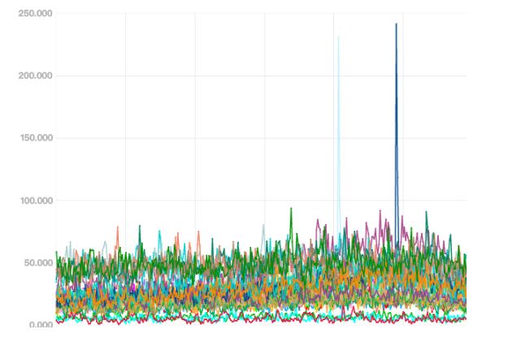

### 并发编程概述
本篇Pool(临时对象池)部分，大量内容摘自以下3篇文章，感谢前辈(强烈建议拜读原文)😀

https://segmentfault.com/a/1190000016987629
https://www.cnblogs.com/qcrao-2018/p/12736031.html#pool-%E7%BB%93%E6%9E%84%E4%BD%93
https://draveness.me/golang/docs/part3-runtime/ch06-concurrency/golang-sync-primitives/

并发编程的本质就是在乱序执行的代码中创建小块的临界区，在临界区中程序线性执行，保证代码的执行结果符合预期.
####  互斥锁

Mutex结构体
sync.Mutex 由两个字段 `state` 和 `sema `组成.其中 `state` 表示当前互斥锁的状态，而 `sema` 是用于控制锁状态的信号量

8 字节空间的结构体
```go
type Mutex struct {
	state int32
	sema  uint32
}
```
Mutex有两个方法Lock和Unlock，分别用于锁定和解锁一个锁
可以使用defer保证解锁
Lock 方法锁住 m，如果 m 已经加锁，则阻塞直到 m 解锁
Unlock 方法解锁 m，如果 m 未加锁会导致运行时错误导致 panic 异常
```go
func (m *Mutex) Lock() {
	// Fast path: grab unlocked mutex.
	if atomic.CompareAndSwapInt32(&m.state, 0, mutexLocked) {
		if race.Enabled {
			race.Acquire(unsafe.Pointer(m))
		}
		return
	}
	// Slow path (outlined so that the fast path can be inlined)
	m.lockSlow()
}
```


```go
func (m *Mutex) Unlock() {
	if race.Enabled {
		_ = m.state
		race.Release(unsafe.Pointer(m))
	}

```

### RWMutex（读写锁）

```go
type RWMutex struct {
	w           Mutex  // held if there are pending writers
	writerSem   uint32 // semaphore for writers to wait for completing readers
	readerSem   uint32 // semaphore for readers to wait for completing writers
	readerCount int32  // number of pending readers
	readerWait  int32  // number of departing readers
}
```
- Mutex只能同时被一个线程锁定，而RWMutex可以多次读锁定，也就是可以进行并发读取
- RWMutex 是单写多读锁，该锁可以加多个读锁或者一个写锁
- 读锁占用的情况下会阻止写，不会阻止读，多个 `goroutine` 可以同时获取读锁
- 写锁会排它，不给任何锁进来，整个锁被`goroutine`独占'

源码`const rwmutexMaxReaders = 1 << 30` 支持最多`2^30`个读锁

RWMutex 是读写互斥锁，锁可以由任意数量的读取器或单个写入器来保持
RWMutex 的零值是一个解锁的互斥锁


#### Lock
提供写锁加锁操作

```go
func (rw *RWMutex) Lock() {
	// 使用 Mutex 锁
	rw.w.Lock()
	// 将当前的 readerCount 置为负数，告诉 RUnLock 当前存在写锁等待
	r := atomic.AddInt32(&rw.readerCount, -rwmutexMaxReaders) + rwmutexMaxReaders
	// 等待读锁释放
	if r != 0 && atomic.AddInt32(&rw.readerWait, r) != 0 {
		runtime_Semacquire(&rw.writerSem)
	}
}
```


#### Unlock
提供写锁释放操作

```go
func (rw *RWMutex) Unlock() {
	// 加上 Lock 的时候减去的 rwmutexMaxReaders
	r := atomic.AddInt32(&rw.readerCount, rwmutexMaxReaders)
	// 没执行Lock调用Unlock，抛出异常
	if r >= rwmutexMaxReaders {
		race.Enable()
		throw("sync: Unlock of unlocked RWMutex")
	}
	// 通知当前等待的读锁
	for i := 0; i < int(r); i++ {
		runtime_Semrelease(&rw.readerSem, false)
	}
	// 释放 Mutex 锁
	rw.w.Unlock()
}
```
#### RLock
提供读锁操作

```go
func (rw *RWMutex) RLock() {
	// 每次 goroutine 获取读锁时，readerCount+1
    // 如果写锁已经被获取，那么 readerCount 在 -rwmutexMaxReaders 与 0 之间，这时挂起获取读锁的 goroutine
    // 如果写锁没有被获取，那么 readerCount > 0，获取读锁, 不阻塞
    // 通过 readerCount 判断读锁与写锁互斥, 如果有写锁存在就挂起goroutine, 多个读锁可以并行
	if atomic.AddInt32(&rw.readerCount, 1) < 0 {
		// 将 goroutine 排到G队列的后面,挂起 goroutine
		runtime_Semacquire(&rw.readerSem)
	}
}
```
#### RUnLock

RUnLock 方法对读锁进行解锁

```go
func (rw *RWMutex) RUnlock() {
	// 写锁等待状态，检查当前是否可以进行获取
	if r := atomic.AddInt32(&rw.readerCount, -1); r < 0 {
		// r + 1 == 0表示直接执行RUnlock()
		// r + 1 == -rwmutexMaxReaders表示执行Lock()再执行RUnlock()
		// 两总情况均抛出异常
		if r+1 == 0 || r+1 == -rwmutexMaxReaders {
			race.Enable()
			throw("sync: RUnlock of unlocked RWMutex")
		}
		// 当读锁释放完毕后，通知写锁
		if atomic.AddInt32(&rw.readerWait, -1) == 0 {
			// The last reader unblocks the writer.
			runtime_Semrelease(&rw.writerSem, false)
		}
	}
}
```
#### RLocker
可以看到 RWMutex 实现接口 Locker

```go
type Locker interface {
	Lock()
	Unlock()
}
```
而方法 RLocker 就是将 RWMutex 转换为 Locker

```go
func (rw *RWMutex) RLocker() Locker {
	return (*rlocker)(rw)
}
```
总结

- 读锁不能阻塞读锁，引入`readerCount`实现
- 读锁需要阻塞写锁，直到所有读锁都释放，引入`readerSem`实现
- 写锁需要阻塞读锁，直到所有写锁都释放，引入`wirterSem`实现
- 写锁需要阻塞写锁，引入Metux实现 `rw.w.Lock()`
 
#### Once

sync.Once保证某个函数有且仅有一次执行，只有一个方法Do

···
func (o *Once) Do(f func())  其中调用doSlow方法
···
sync.Once 是 Golang package 中使方法只执行一次的对象实现，作用与 init 函数类似.但也有所不同.

init 函数是在文件包首次被加载的时候执行，且只执行一次
sync.Onc 是在代码运行中需要的时候执行，且只执行一次

当一个函数不希望程序在一开始的时候就被执行的时候，我们可以使用 sync.Once

sync.Once 使用变量 done 来记录函数的执行状态，使用 sync.Mutex 和 sync.atomic 来保证线程安全的读取 done .


### 临时对象池pool


sync.Pool 是 sync 包下的一个组件，可以作为保存临时取还对象的一个“池”
Pool 里装的对象可以被无通知地被回收
Pool 是用来缓存·已经申请了·的 目前·未使用·的 接下来·可能会使用的· 内存

对于很多需要重复分配、回收内存的地方，sync.Pool 是一个很好的选择.
频繁地分配、回收内存会给 GC 带来一定的负担，严重的时候会引起 CPU 的毛刺，而 sync.Pool 可以将暂时不用的对象缓存起来.
CPU毛刺现象，可以说这个词很形象了，即服务运行不平稳
待下次需要的时候直接使用，不用再次经过内存分配，复用对象的内存，减轻 GC 的压力，提升系统的性能.

Pool 中有两个定义的公共方法，分别是 `Put` 向池中添加元素；`Get `从池中获取元素，如果没有，则调用 New 生成元素，如果 New 未设置，则返回 nil.



```go
type Pool struct {
	noCopy noCopy
    // 每个 P 的本地队列，实际类型为 [P]poolLocal
	local     unsafe.Pointer // local fixed-size per-P pool, actual type is [P]poolLocal
	// [P]poolLocal的大小
	localSize uintptr        // size of the local array
	victim     unsafe.Pointer // local from previous cycle
	victimSize uintptr        // size of victims array
	// 自定义的对象创建回调函数，当 pool 中无可用对象时会调用此函数
	New func() interface{}
}
```
local 字段存储指向 [P]poolLocal切片的指针，localSize 则表示 local 数组的大小。
访问时，P 的 id 对应 [P]poolLocal 下标索引。通过这样的设计，多个 goroutine 使用同一个 Pool 时，减少了竞争，提升了性能。

在一轮 GC 到来时，·victim· 和 ·victimSize· 会分别“接管” ·local· 和 ·localSize·。
victim 的机制用于减少 GC 后·冷启动·导致的·性能抖动·，让分配对象更平滑。

因为 Pool 不希望被复制，所以结构体里有一个 noCopy 的字段 ·noCopy 是 go1.7 开始引入的一个静态检查机制.它不仅仅工作在运行时或标准库，同时也对用户代码有效.·
实现非常简单：

···
// noCopy 用于嵌入一个结构体中来保证其第一次使用后不会被复制
//
// 见 https://golang.org/issues/8005#issuecomment-190753527
type noCopy struct{}

// Lock 是一个空操作用来给 `go ve` 的 -copylocks 静态分析
func (*noCopy) Lock()   {}
func (*noCopy) Unlock() {}
···

```go
type poolLocal struct {
   	poolLocalInternal
   
   	// 将 poolLocal 补齐至两个缓存行的倍数，防止 false sharing,
   	// 每个缓存行具有 64 bytes，即 512 bit
   	// 目前我们的处理器一般拥有 32 * 1024 / 64 = 512 条缓存行
   	// 伪共享，仅占位用，防止在 cache line 上分配多个 poolLocalInternal
   	pad [128 - unsafe.Sizeof(poolLocalInternal{})%128]byte
}
```
```go
 // Local per-P Pool appendix.
   type poolLocalInternal struct {
       // P 的私有缓存区，使用时无需要加锁
   	private interface{}
   	// 公共缓存区.本地 P 可以 pushHead/popHead；其他 P 则只能 popTail
   	shared  poolChain
   }
```
现代 cpu 中，cache 都划分成以 cache line (cache block) 为单位，在 x86_64 体系下一般都是 64 字节，cache line 是操作的最小单元。
程序即使只想读内存中的 1 个字节数据，也要同时把附近 63 节字加载到 cache 中，如果读取超个 64 字节，那么就要加载到多个 cache line 中。
简单来说，如果没有 pad 字段，那么当需要访问 0 号索引的 poolLocal 时，CPU 同时会把 0 号和 1 号索引同时加载到 cpu cache。
在只修改 0 号索引的情况下，会让 1 号索引的 poolLocal 失效。这样，当其他线程想要读取 1 号索引时，发生 cache miss，还得重新再加载，对性能有损。
增加一个 pad，补齐缓存行，让相关的字段能独立地加载到缓存行就不会出现 false sharding 了

sync.Pool 是协程安全的，这对于使用者来说是极其方便的.
使用前，设置好对象的 New 函数，用于在 Pool 里没有缓存的对象时，创建一个.
之后，在程序的任何地方、任何时候仅通过 Get()、Put() 方法就可以取、还对象了

·当多个 goroutine 都需要创建同⼀个对象的时候，如果 goroutine 数过多，导致对象的创建数⽬剧增，进⽽导致 GC 压⼒增大.
形成 “并发⼤－占⽤内存⼤－GC 缓慢－处理并发能⼒降低－并发更⼤”这样的恶性循环.
在这个时候，需要有⼀个对象池，每个 goroutine 不再⾃⼰单独创建对象，⽽是从对象池中获取出⼀个对象（如果池中已经有的话）
·  --By 《Go夜读》

#### Get
P的含义实际上是`goroutine`调度里面的一个概念，每个`goroutine`都会必须要绑定一个`P`才能得以执行.
每个P都有一个待执行的goroutine队列，P的个数一般设置的跟CPU核数相等
Pool 会为每个 P 维护一个本地池，P 的本地池分为 私有池 private 和共享池 shared。
私有池中的元素只能本地 P 使用，共享池中的元素可能会被其他 P 偷走，所以使用私有池 private 时不用加锁，而使用共享池 shared 时需加锁。
Get 会优先查找本地 `private`，再查找本地 `shared`，最后查找其他 P 的 `shared`，如果以上全部没有可用元素，最后会调用 New 函数获取新元素。

```go
func (p *Pool) Get() interface{} {
   if race.Enabled {
      race.Disable() //race的设置，看代码是不允许检测
   }
   // 获取本地 P 的 poolLocal 对象
   l := p.pin() 
   
   // 先获取 private 池中的对象（只有一个）
   x := l.private
   l.private = nil
   runtime_procUnpin()
   if x == nil {
      // 查找本地 shared 池，
      // 本地 shared 可能会被其他 P 访问
      // 需要加锁
      l.Lock()
      last := len(l.shared) - 1
      if last >= 0 {
         x = l.shared[last]
         l.shared = l.shared[:last]
      }
      l.Unlock()
      
      // 查找其他 P 的 shared 池
      if x == nil {
         x = p.getSlow()
      }
   }
   if race.Enabled {
      race.Enable()
      if x != nil {
         race.Acquire(poolRaceAddr(x))
      }
   }
   // 未找到可用元素，调用 New 生成
   if x == nil && p.New != nil {
      x = p.New()
   }
   return x
}
- 首先，调用 p.pin() 函数将当前的 goroutine 和 P 绑定，禁止被抢占，返回当前 P 对应的 poolLocal，以及 pid。

- 然后直接取 l.private，赋值给 x，并置 l.private 为 nil。

- 判断 x 是否为空，若为空，则尝试从 l.shared 的头部 pop 一个对象出来，同时赋值给 x。

- 如果 x 仍然为空，则调用 getSlow 尝试从其他 P 的 shared 双端队列尾部“偷”一个对象出来。

- Pool 的相关操作做完了，调用 runtime_procUnpin() 解除非抢占。

- 最后如果还是没有取到缓存的对象，那就直接调用预先设置好的 New 函数，创建一个出来。


```
`getSlow`，从其他 P 中的 `shared` 池中获取可用元素：

```go
func (p *Pool) getSlow() (x interface{}) {
   // See the comment in pin regarding ordering of the loads.
   size := atomic.LoadUintptr(&p.localSize) // load-acquire
   local := p.local                         // load-consume
   // Try to steal one element from other procs.
   pid := runtime_procPin()
   runtime_procUnpin()
   for i := 0; i < int(size); i++ {
      l := indexLocal(local, (pid+i+1)%int(size))
      // 对应 pool 需加锁
      l.Lock()
      last := len(l.shared) - 1
      if last >= 0 {
         x = l.shared[last]
         l.shared = l.shared[:last]
         l.Unlock()
         break
      }
      l.Unlock()
   }
   return x
}
```

#### Put
Put 优先把元素放在 `private` 池中；如果 private 不为空，则放在 shared 池中。有趣的是，在入池之前，该元素有 1/4 可能被丢掉。
```go
func (p *Pool) Put(x interface{}) {
   if x == nil {
      return
   }
   if race.Enabled {
      if fastrand()%4 == 0 {  
         // 随机把元素扔掉...  这个设计挺有意思
         // Randomly drop x on floor.
         return
      }
      race.ReleaseMerge(poolRaceAddr(x))
      race.Disable()
   }
   l := p.pin()
   if l.private == nil {
      l.private = x
      x = nil
   }
   runtime_procUnpin()
   if x != nil {
      // 共享池访问，需要加锁
      l.Lock()
      l.shared = append(l.shared, x)
      l.Unlock()
   }
   if race.Enabled {
      race.Enable()
   }
}
```
#### poolCleanup
当世界暂停（STW），垃圾回收将要开始时， `poolCleanup` 会被调用。该函数内不能分配内存且不能调用任何运行时函数。
原因：
防止错误的保留整个 Pool
如果 GC 发生时，某个 goroutine 正在访问 l.shared，整个 Pool 将会保留，下次执行时就会有双倍内存


