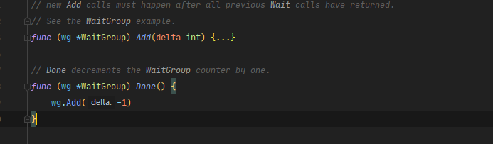

### WaitGroup



参数delta可能是负的，加到WaitGroup计数器,可能出现如下结果
- 如果计数器变为零，所有被阻塞的goroutines都会被释放。
- 如果计数器变成负数，将会报出一个panic 错误。

一般情况：
- WaitGroup 对象内部有一个计数器，最初从0开始，它有三个方法：Add(), Done(), Wait() 用来控制计数器的数量。
- Add(n) 把计数器设置为n ，Done() 每次把计数器-1(就是调用Add(-1)) ，wait() 会阻塞代码的运行，直到计数器地值减为0。

#### 举个例子

原始代码
```go
package main

import (
    "fmt"
    "time"
)

func main(){
    for i := 0; i < 100 ; i++{
        go fmt.Println(i)
    }
    time.Sleep(time.Second)
}
```

主线程为了等待goroutine都运行完毕，不得不在程序的末尾使用time.Sleep() 来睡眠一段时间，等待其他线程充分运行。对于简单的代码，100个for循环可以在1秒之内运行完毕，time.Sleep() 也可以达到想要的效果。

但是对于实际生活的大多数场景来说，1秒是不够的，并且大部分时候我们都无法预知for循环内代码运行时间的长短。这时候就不能使用time.Sleep() 来完成等待操作了

对于这种情况，go语言中有一个其他的工具`sync.WaitGroup` 能更加方便的帮助我们达到这个目的

#### 解决方案

```go
func main() {
    wg := sync.WaitGroup{}
    wg.Add(100)
    for i := 0; i < 100; i++ {
        go func(i int) {
            fmt.Println(i)
            wg.Done()
        }(i)
    }
    wg.Wait()
}
```

首先把wg 计数设置为100， 每个for循环运行完毕都把计数器减一，主函数中使用Wait() 一直阻塞，直到wg为零——也就是所有的100个for循环都运行完毕。
代码格式十分优美，可读性也变高


#### Tips

- 不要使用Add() 给wg 设置一个负值
- 同样使用Done() 也要特别注意不要把计数器设置成负数
- WaitGroup对象不是一个引用类型,在通过函数传值的时候需要使用地址

```go
func main() {
    wg := sync.WaitGroup{}
    wg.Add(100)
    for i := 0; i < 100; i++ {
        go f(i, &wg)
    }
    wg.Wait()
}

// 一定要通过指针传值，不然进程会进入死锁状态
func f(i int, wg *sync.WaitGroup) { 
    fmt.Println(i)
    wg.Done()
}
```


