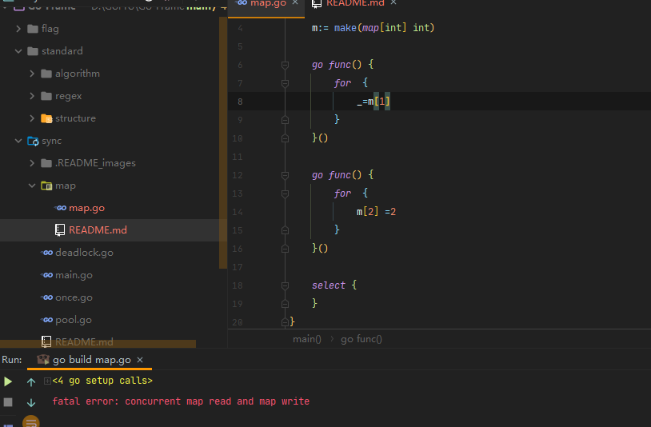

### sync.map

内建的map不是线程(goroutine)安全的

在并发读写过程中,下列程序中一个goroutine一直读，一个goroutine一只写同一个键值，即即使读写的键不相同，而且map也没有"扩容"等操作，代码还是会报错


Java中存在的并发安全的Map--`ConcurrentHashMap`
`ConcurrentHashMap`使用细粒度的锁控制，也就是分段锁。每个区间共享一把锁，这样就减少了所有数据都用一把锁带来的性能影响

当然在go中也有大佬实现了 
[🔒](https://github.com/orcaman/concurrent-map/blob/master/README-zh.md)

##### sync.Map的数据结构

```go
type Map struct {
	// 当涉及到dirty数据的操作的时候，需要使用这个锁
	mu Mutex
	// 一个只读的数据结构，因为只读，所以不会有读写冲突。
	// 所以从这个数据中读取总是安全的。
	// 实际上，实际也会更新这个数据的entries,如果entry是未删除的(unexpunged), 并不需要加锁。如果entry已经被删除了，需要加锁，以便更新dirty数据。
	read atomic.Value // readOnly
	// dirty数据包含当前的map包含的entries,它包含最新的entries(包括read中未删除的数据,虽有冗余，但是提升dirty字段为read的时候非常快，不用一个一个的复制，而是直接将这个数据结构作为read字段的一部分),有些数据还可能没有移动到read字段中。
	// 对于dirty的操作需要加锁，因为对它的操作可能会有读写竞争。
	// 当dirty为空的时候， 比如初始化或者刚提升完，下一次的写操作会复制read字段中未删除的数据到这个数据中。
	dirty map[interface{}]*entry
	// 当从Map中读取entry的时候，如果read中不包含这个entry,会尝试从dirty中读取，这个时候会将misses加一，
	// 当misses累积到 dirty的长度的时候， 就会将dirty提升为read,避免从dirty中miss太多次。因为操作dirty需要加锁。
	misses int
}
```

写：直写dirty。 读：先读read，没有再读dirty。
sync.Map里有两个map一个是专门用于读的`read map`，另一个是才是提供读写的`dirty map`；
优先读read map，若不存在则加锁穿透读dirty map，同时记录一个未从read map读到的计数，当计数到达一定值，就将read map用dirty map进行覆盖。


`dirty`是直接删除，而`read`是标记删除
通过空间换时间进行读写分离

不适用于大量写的场景，这样会导致read map读不到数据而进一步加锁读取，同时dirty map也会一直晋升为read map，整体性能较差。


#### 遍历
for ... range map是内建的语言特性，所以没有办法使用for range遍历sync.Map, 但是可以使用它的Range方法，通过回调的方式遍历
```go
func (m *Map) Range(f func(key, value interface{}) bool) {
	read, _ := m.read.Load().(readOnly)
	// 如果m.dirty中有新数据，则提升m.dirty,然后在遍历
	if read.amended {
		//提升m.dirty
		m.mu.Lock()
		read, _ = m.read.Load().(readOnly) //双检查
		if read.amended {
			read = readOnly{m: m.dirty}
			m.read.Store(read)
			m.dirty = nil
			m.misses = 0
		}
		m.mu.Unlock()
	}
	// 遍历, for range是安全的
	for k, e := range read.m {
		v, ok := e.load()
		if !ok {
			continue
		}
		if !f(k, v) {
			break
		}
	}
}
```
